# Contact-Management 
## 📑 Content
- [About](#-about)
- [Screenshots](#-screenshots)
- [Contributors](#contributors)
## 📖 About

The Contact Management System is a robust and user-friendly application designed to help users efficiently store and manage their contact information. Built using a structured programming approach, this system seamlessly incorporates essential programming concepts, making it both powerful and easy to navigate.

### Features
- **Store Contact Information**: Safely save contact details including names, phone numbers, email addresses, and more.
- **Manage Contacts**: Easily add, update, delete, and search for contacts within the system.
- **User-Friendly Interface**: Intuitive design ensures smooth navigation and ease of use for all users.
- **Core Programming Concepts**: Built with fundamental programming principles such as loops, conditionals, functions, and data structures to ensure reliable and efficient performance.
### Technologies Used
- **Programming Language**: C++
- **Data Storage**: Files
- **User Interface**: command-line interface

## 📷 Screenshots
- **Login**
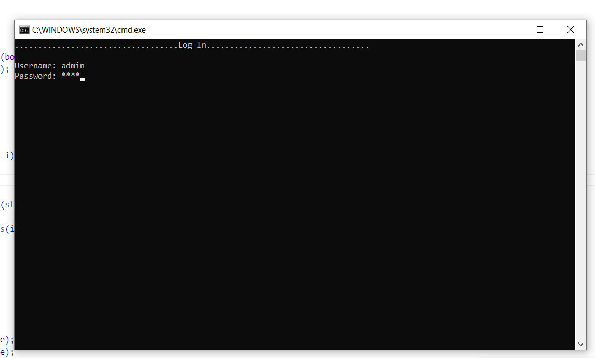
- **Mainmenu**
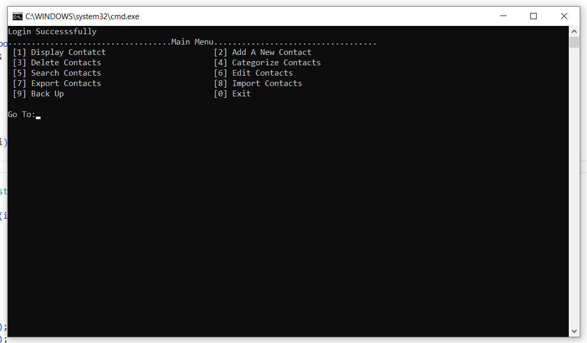
- **Adding a Contact**
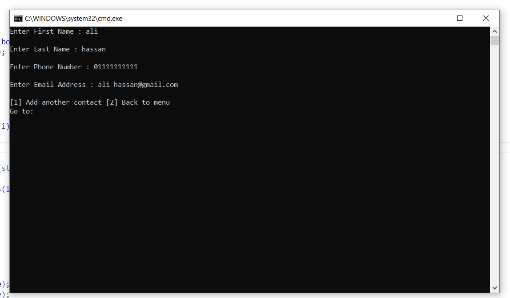
- **Display a contact**
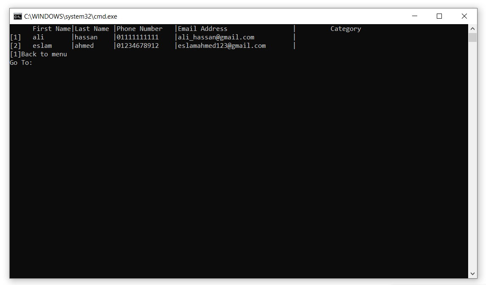
- **Categories a contact**
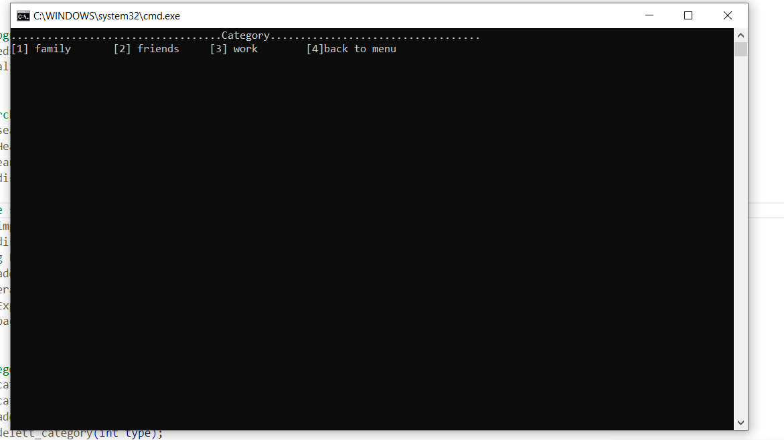
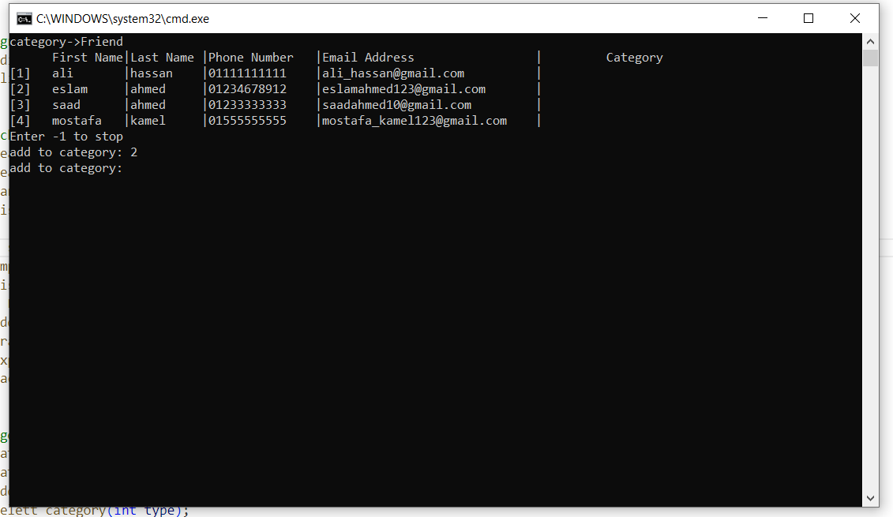
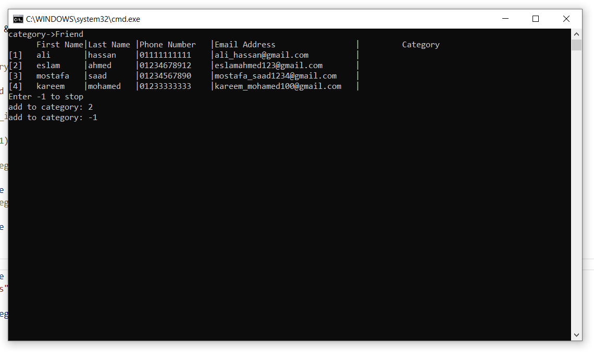
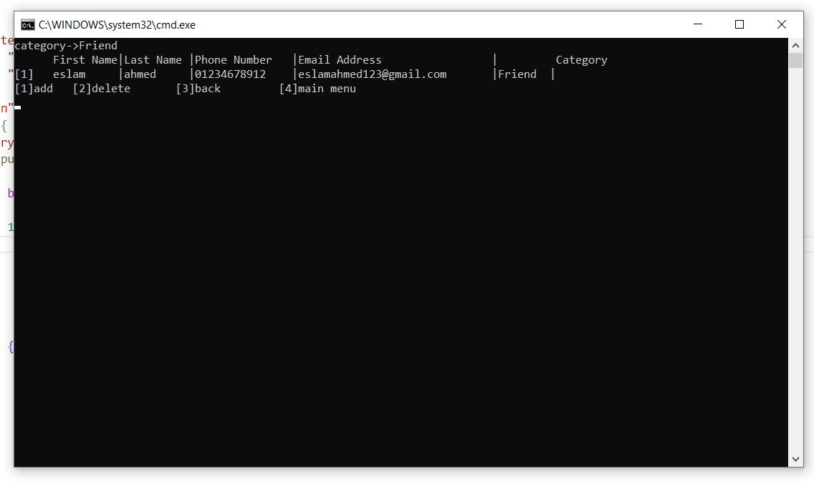
- **Searching for a contact**

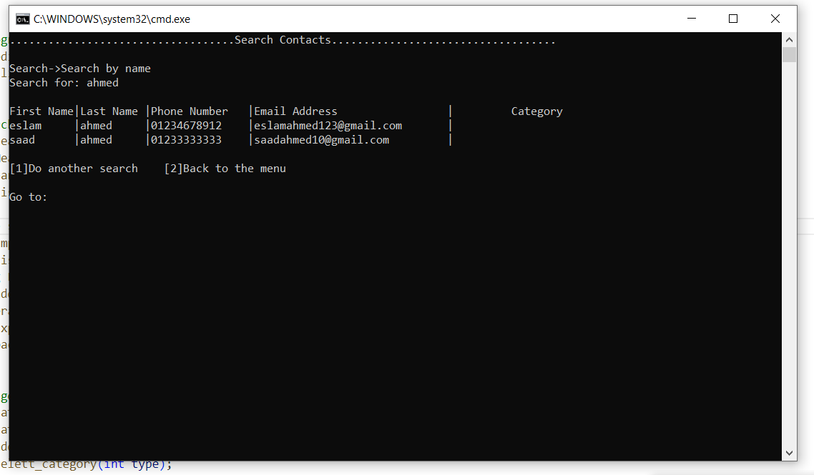

- **Editing a contact**
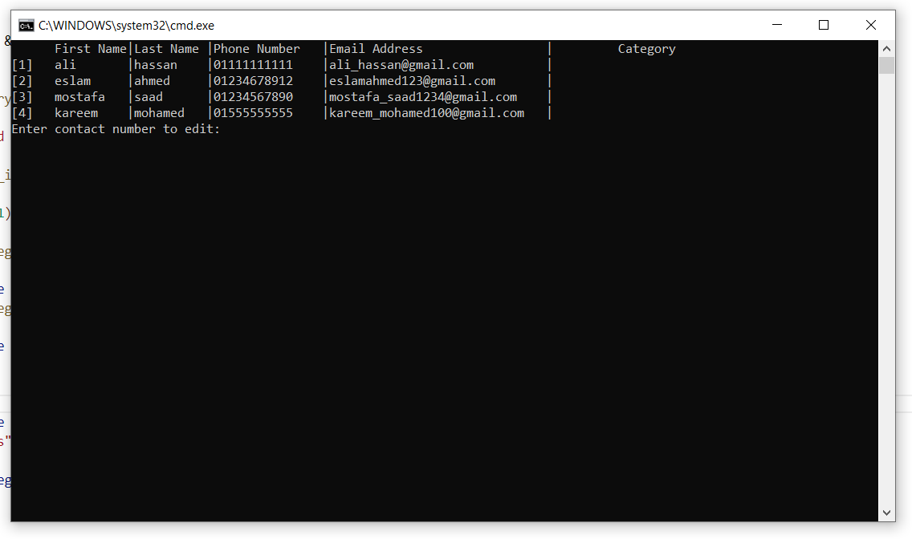

- **Deleting a contact**
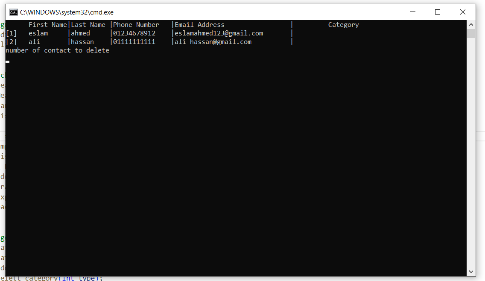

- **Importing contacts**
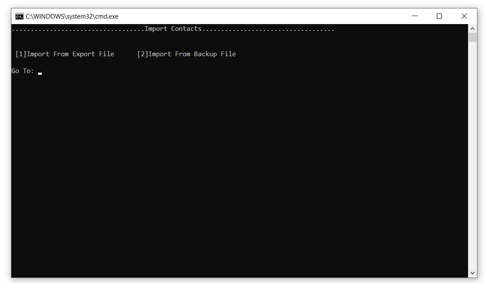
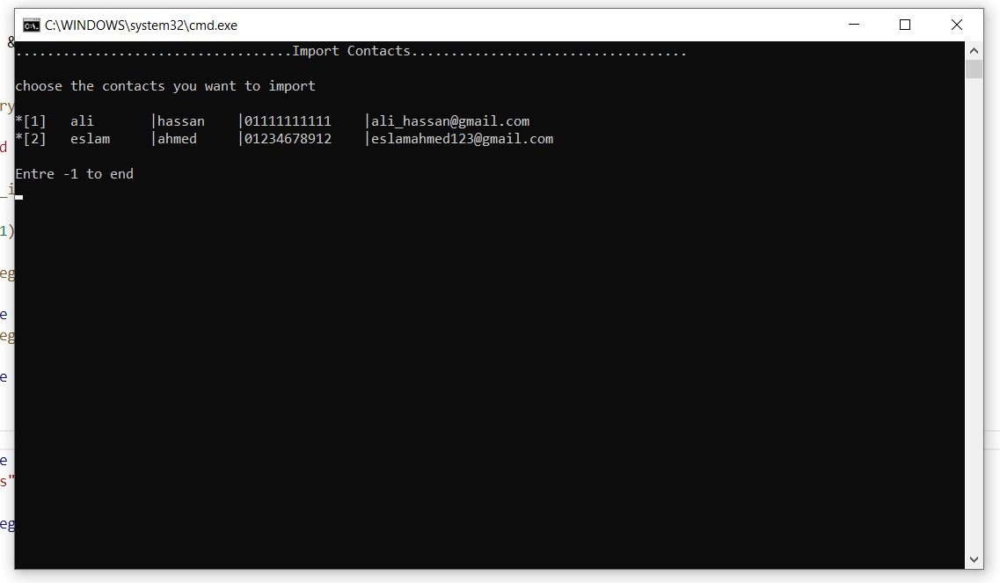

## Contributors
- [Eslam Adly](https://github.com/EslamAdly)
- [Adham Saeed](https://github.com/adham667)
- [Eslam Amr](https://github.com/Eslam-Amr)
- [Osama Mahmoud](https://github.com/Osama-Mahmoud1)
- [Eslam Ahmed](https://github.com/Eslam-Ahmed007)
